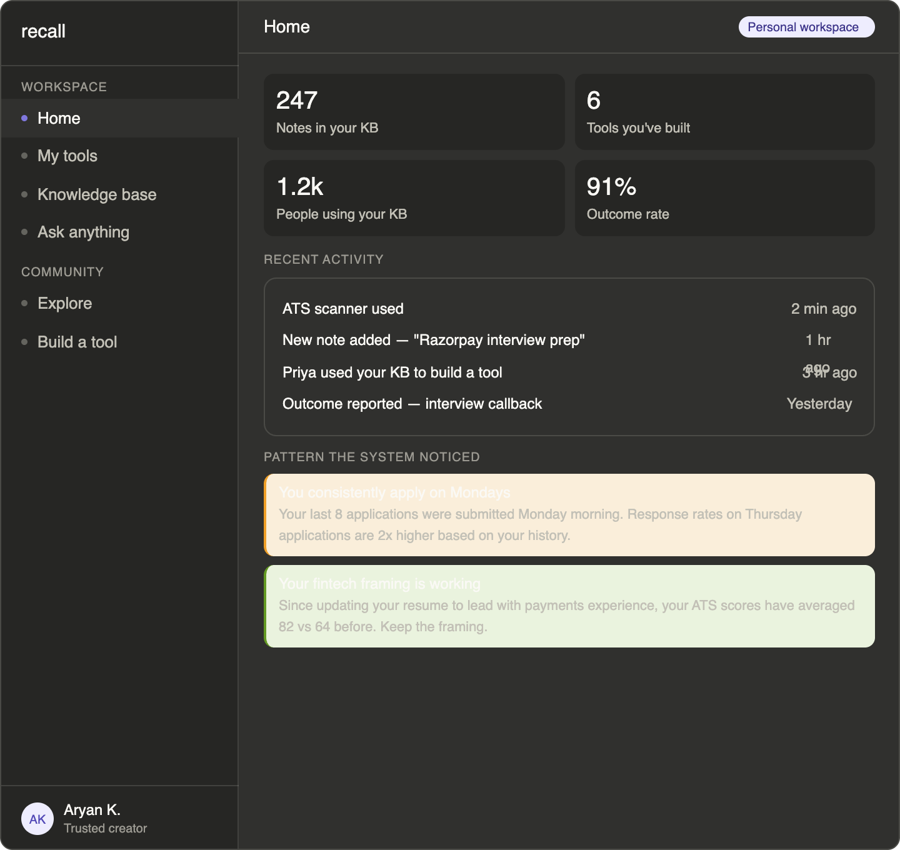
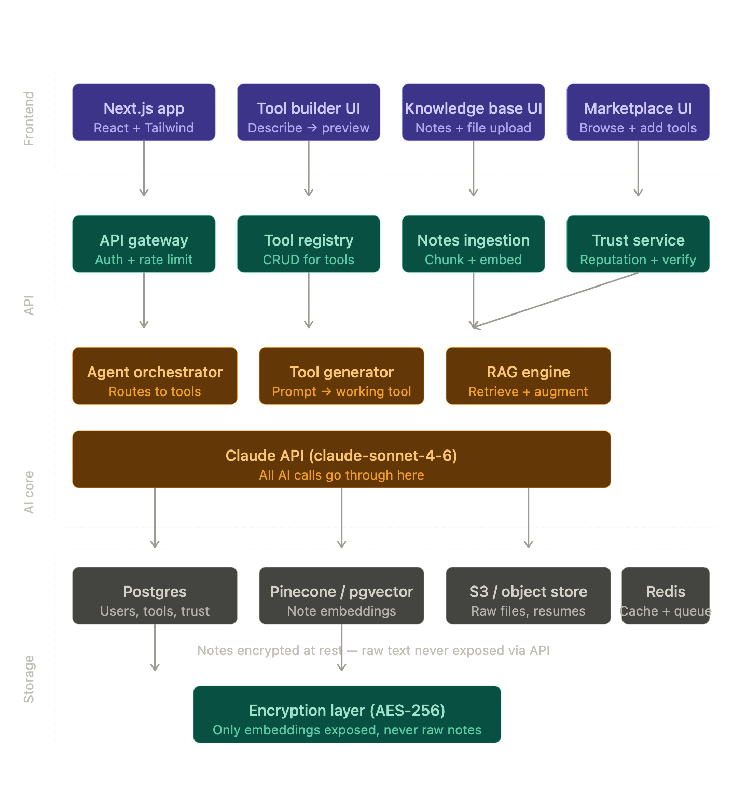
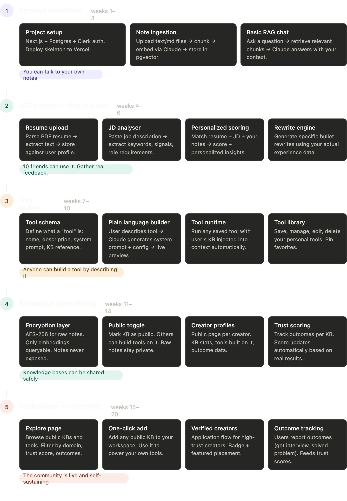

# Omniverse

A personal knowledge base platform that turns your notes into AI-powered tools. Upload notes, build custom tools on top of them using plain language, and share your expertise through a community marketplace — all without writing a single line of code.

## What It Does

- **Knowledge Base** — Upload notes and files. They get chunked, embedded, and stored as vectors. Your raw notes stay encrypted (AES-256) and are never exposed through the API — only embeddings are queryable.
- **AI Chat (RAG)** — Ask anything and get answers grounded in your personal notes. The RAG engine retrieves relevant chunks from your knowledge base and injects them into the LLM context.
- **Tool Builder** — Describe a tool in plain language and the AI generates a full tool config with a live preview. Each tool is powered by your knowledge base. No code, no config files.
- **Marketplace** — Browse and add verified knowledge bases from other creators. One-click add to your workspace so your tools can draw on their expertise too. Trust scores update automatically based on real outcomes.
- **Pattern Detection** — The system surfaces patterns about your behavior over time (e.g., application timing, framing strategies that work) and gets more valuable every week.

## Architecture

- **Frontend** — Next.js + React + Tailwind. Server-side rendered. Screens: Home dashboard, My Tools, Knowledge Base, Ask Anything, Explore marketplace, Tool Builder.
- **API Layer** — API gateway (auth + rate limiting), tool registry (CRUD), notes ingestion (chunk + embed), trust service (reputation + verification).
- **AI Core** — Agent orchestrator (routes to tools), tool generator (prompt to working tool), RAG engine (retrieve + augment). All AI calls go through a single Claude API connection.
- **Storage** — Postgres (users, tools, trust scores), pgvector/Pinecone (note embeddings), S3 (raw files), Redis (cache + queue).
- **Encryption** — AES-256 at rest. Raw notes go in encrypted, stay encrypted, never come back out. Only embeddings are queryable.

## Roadmap

| Phase | Timeline | Milestone |
|-------|----------|-----------|
| 1. Personal Foundation | Weeks 1–3 | Note ingestion + basic RAG chat. You can talk to your own notes. |
| 2. ATS Scanner (First Tool) | Weeks 4–6 | Resume upload, JD analysis, personalized scoring, rewrite engine. Gather real feedback from 10 users. |
| 3. Tool Builder | Weeks 7–10 | Tool schema, plain language builder, tool runtime with KB injection, tool library. Anyone can build a tool by describing it. |
| 4. Knowledge Base Sharing | Weeks 11–14 | Encryption layer, public toggle, creator profiles, trust scoring. Knowledge bases can be shared safely. |
| 5. Marketplace + Community | Weeks 15–20 | Explore page, one-click add, verified creators, outcome tracking. The community is live and self-sustaining. |

## Tech Stack

Next.js | Postgres + pgvector | Claude API | S3 | Redis | Clerk Auth | Vercel
